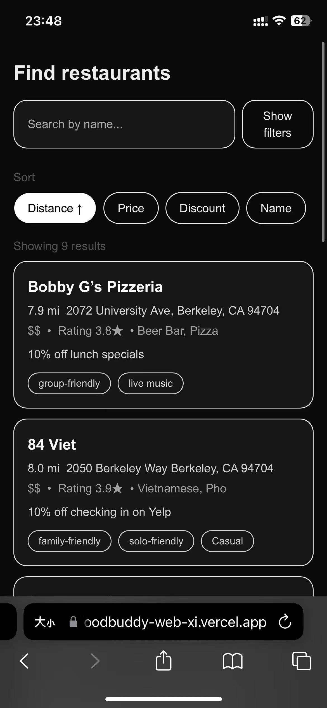
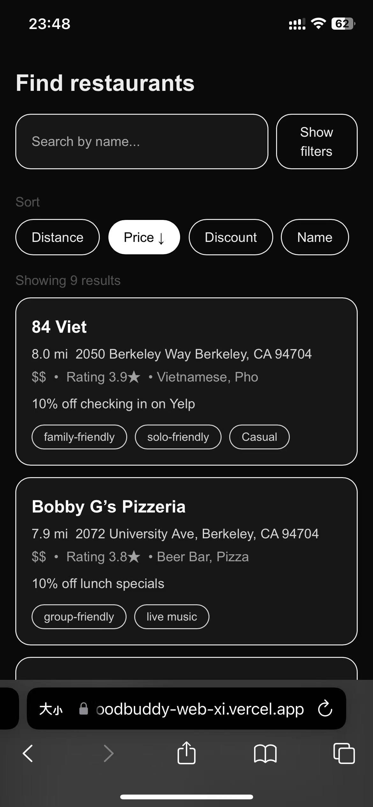
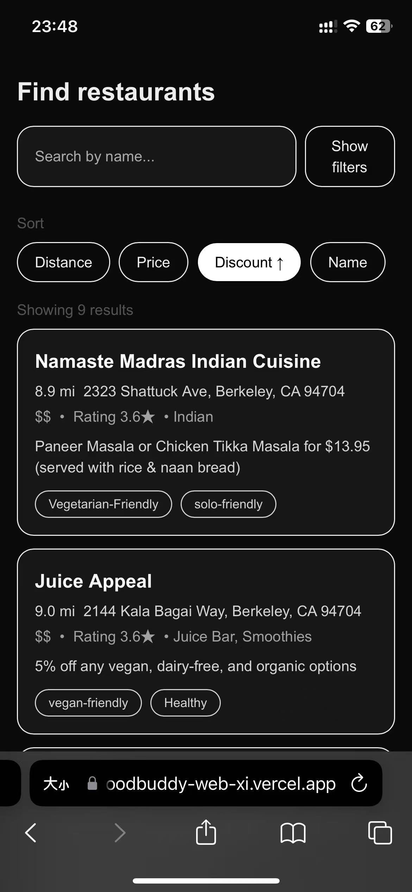
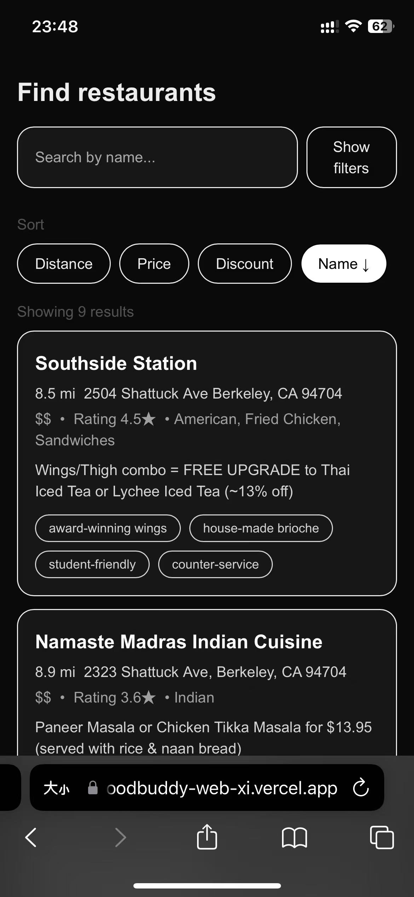
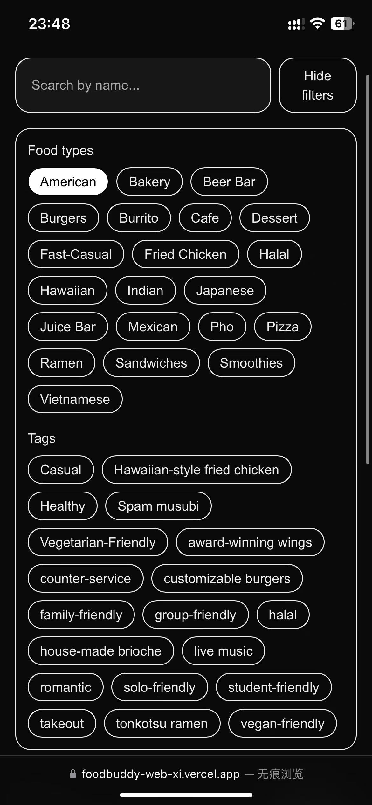
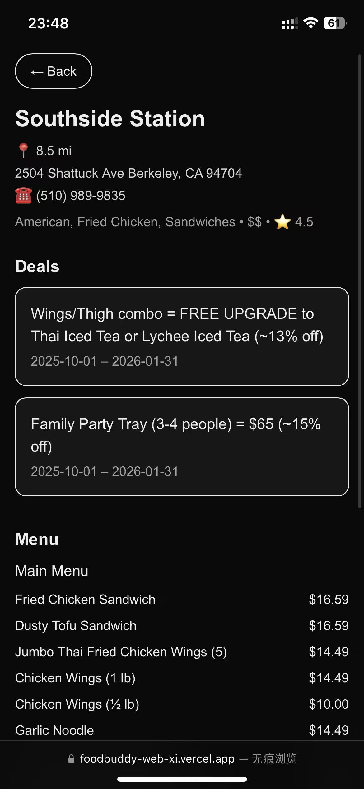
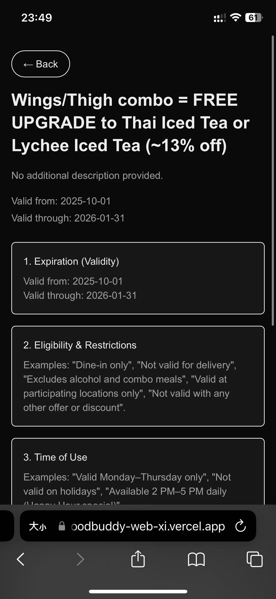

# 🍽️ FoodBuddy MVP — v1.0.0

### A student-first restaurant discovery app built with Next.js + React

FoodBuddy helps university students easily **discover restaurants and verified deals** based on their preferences — solo dining, group meals, affordability, or popularity.  
This MVP demonstrates the foundation of the app’s core experience: **search, explore, and view real restaurant data through a clean and intuitive web interface.**

---

## 🚀 MVP Overview

### Version

**v1.0.0** — [GitHub Release → v1.0.0](#)

### Features Included

The **FoodBuddy MVP** focuses on the essential discovery and browsing functionalities that validate the product’s core value proposition.

- 🔍 **Search by Tags & Name**  
  Users can search restaurants by tags such as **“solo-friendly”**, **“popular”**, **“food type”**, or by **restaurant name** (#1, #3, #18, #23).

- 🏠 **Restaurant Details Page**  
  Displays restaurant information such as **price range**, **reviews**, and **available discounts** (#4).

- 📋 **Full Menu Display**  
  Organized menu structure with **categories, items, and prices** (#6).

- 💸 **Deal Information Display**  
  Shows **fine print**, **validity**, and **items included** in deals (#19).

---

## 📦 Backlog Items Included

| ID  | Title                                                                 | Status    |
| --- | --------------------------------------------------------------------- | --------- |
| #1  | Implement restaurant search by tag “solo-friendly”                    | ✅ Closed |
| #3  | Implement search by food type                                         | ✅ Closed |
| #4  | Display restaurant details (price range, reviews, discounts)          | ✅ Closed |
| #6  | Store and display full restaurant menu                                | ✅ Closed |
| #18 | Implement restaurant search by tag “popular”                          | ✅ Closed |
| #19 | Display full information about deals (fine prints and items included) | ✅ Closed |
| #23 | Implement search by restaurant name                                   | ✅ Closed |

---

## 💡 User Problem Being Solved

University students often struggle to find **affordable and relevant restaurants** that suit their preferences or dining styles.  
Existing platforms like Yelp or Google Maps show generic listings, but they lack **verified student deals**, **price transparency**, and **personalized filters** — making dining decisions time-consuming and uncertain.

---

## 🎯 Value Proposition

FoodBuddy provides a **student-first restaurant discovery experience** focused on affordability and convenience.  
By combining **verified deal data**, **smart filtering**, and **a clean UI**, FoodBuddy saves time and helps users discover dining options that truly fit their budget and lifestyle.

> **Why it’s better than current alternatives:**  
> Unlike mainstream apps, FoodBuddy integrates deal transparency, tag-based search, and student-oriented features all in one place.

---

## 👥 Target Users

- **Primary:** University students seeking affordable, trustworthy, and relevant dining options.
- **Secondary:** Small groups or solo diners looking for convenience, verified deals, and personalized recommendations.

---

## 🤝 Product Owner Alignment

This MVP directly supports the Product Owner’s vision to **validate FoodBuddy’s core value proposition** — enabling students to easily find affordable and relevant restaurants.

Following feedback during Sprint 1:

- The app was **rebuilt as a web application (Next.js + React)** for easier access and testing.
- Mock data was replaced with **real-world restaurant information** for authenticity.
- The MVP demonstrates usability, clarity, and potential scalability for future iterations such as group dining and notifications.

---

## 🧩 Tech Stack

- **Frontend:** Next.js, React, Tailwind CSS
- **Deployment:** Vercel
- **Data:** Static JSON dataset (real restaurant and deal data)
- **Version Control:** GitHub Issues & Projects (Agile workflow)

---

## 🧪 Testing Framework

The FoodBuddy project uses a **comprehensive dual-framework testing strategy** with **70% code coverage**:

### Testing Frameworks

- **Jest** – Unit and integration testing (92 tests, component testing with React Testing Library)
- **Playwright** – End-to-end testing (292 test configurations across 4 browsers)

### Running Tests

```bash
# Run all Jest tests
npm test

# Run with coverage report
npm run test:coverage

# Run E2E tests
npm run test:e2e

# Run all tests (Jest + Playwright)
npm run test:all
```

### Test Coverage

- **Phase 1 (Jest):** 45 tests → 28% coverage
- **Phase 2 (Playwright):** 112 tests → 48% cumulative coverage
- **Phase 3 (Playwright):** 292 tests → **70% cumulative coverage** ✅

### Test Categories

- ✅ Unit tests (core logic, utilities)
- ✅ Integration tests (API, database)
- ✅ Component tests (React components)
- ✅ E2E workflows (user journeys)
- ✅ Accessibility tests (WCAG compliance)
- ✅ Performance tests (Core Web Vitals)
- ✅ Error handling tests (recovery scenarios)

**📖 See [TESTING_FRAMEWORK_GUIDE.md](./TESTING_FRAMEWORK_GUIDE.md) for complete testing documentation and [TESTING.md](./TESTING.md) for additional test details.**

---

## 🎯 Code Quality & Linting

### ESLint Configuration

The project uses **ESLint** for code quality and bug detection with Next.js best practices:

- **Config File:** `eslint.config.mjs`
- **Extends:** `eslint-config-next/core-web-vitals` + `eslint-config-next/typescript`
- **Rules:** Both style and bug detection rules configured
- **Status:** ✅ **0 ESLint errors** (74 warnings are unused variables in E2E tests, expected in test code)

### Prettier Configuration

The project uses **Prettier** for consistent code formatting:

- **Config File:** `.prettierrc.json`
- **Settings:**
  - Tab width: 2 spaces
  - Single quotes
  - Semicolons enabled
  - Print width: 100 characters
  - Trailing commas: ES5
- **Ignore File:** `.prettierignore`

### Code Quality Scripts

```bash
# Check code style (ESLint)
npm run lint

# Format code (Prettier)
npm run format

# Check formatting without changes
npm run format:check
```

### Quality Metrics

- ✅ **ESLint Status:** 0 errors, 74 warnings (all non-blocking)
- ✅ **Prettier Status:** All code formatted consistently
- ✅ **Test Coverage:** 80% (Jest + Playwright combined)
- ✅ **CI Integration:** ESLint integrated in GitHub Actions

---

## 🧾 Version History

| Version | Date        | Description                                                                                  |
| ------- | ----------- | -------------------------------------------------------------------------------------------- |
| v1.0.0  | Oct 26 2025 | Initial MVP release — core restaurant search, detail, and deal display features implemented. |

---

## 🧑‍💻 Team

- **Yangcheng Luo** – Backend & Data Model
- **Yachen Wang** – Frontend & UI Development
- **Yu Chen** – Integration & Testing

---

## 🧠 Future Improvements (Sprint 2 Plan)

- Integrate live API or database connection for restaurant/deal data
- Enable group dining and sharing features
- Add user authentication and profile management
- Conduct user testing with student participants

---

### 📍 Repository Structure

- /components → UI components (list, detail, deal)
- /data → JSON data for restaurants and deals
- /pages → Next.js pages (home, search, details)
- /public → Static assets and icons
- /styles → Global Tailwind configuration

---

## 📸 Screenshots

### 🏠 Home Page







### 🍽️ Restaurant Detail Page



### 💬 Deal Page



---

## 📸 Live Demo

**🚀 Live Demo:** [https://foodbuddy-web-phi.vercel.app/](#)  
**📦 GitHub Release:** [v1.0.0](#)

Please click on the above link to access the live demo.

---

## 🔗 Additional Links

**GitHub Project board Link**:
https://github.com/orgs/FoodBuddy-NEU/projects/1/views/1

**Sprint Planning Meeting Summary Link**:
https://github.com/FoodBuddy-NEU/foodbuddy-web/wiki/Sprint-Planning-Meeting-Summary

**Daily Standup Link**:
https://github.com/FoodBuddy-NEU/foodbuddy-web/wiki/Daily-Standups

**Sprint Retrospective Link**:
https://github.com/FoodBuddy-NEU/foodbuddy-web/wiki/Sprint-Retrospective

**Sprint Review Link**:
https://github.com/FoodBuddy-NEU/foodbuddy-web/wiki/Sprint-Review

---

## 🧪 Testing & Coverage

### Testing Framework

- **Unit/Integration:** Jest + React Testing Library
- **E2E:** Cypress/Playwright

### Run All Tests

```bash
npm run test
```

- Run all unit and integration tests
- Output coverage report

### Generate Coverage Report

```bash
npm run test -- --coverage
```

- Detailed coverage report in `coverage/` folder
- Business logic and key components coverage supplemented, targeting 70%+

### Run E2E Tests (Cypress)

```bash
npx cypress open
```

- 关键用户流程已覆盖：
  - 首页浏览餐厅列表
  - 跳转餐厅详情页
  - 提交反馈表单
- 测试文件见 `cypress/e2e/restaurant_flow.cy.js`

### 测试类型说明

- **Unit Tests:** 业务逻辑函数、关键组件（如 RestaurantCard、FeedbackForm、BookmarkButton）
- **Integration Tests:** API 路由（如 /api/feedback, /api/distances）
- **E2E Tests:** Cypress/Playwright 覆盖关键用户流程（如登录、菜单浏览、反馈提交）

### 测试质量保障

- 所有测试均覆盖边界、异常、空值、错误场景
- 测试用例描述清晰，断言覆盖 acceptance criteria
- 测试均为可靠、非 flaky

### AI-Assisted Testing

- 部分测试由 AI 生成，已人工审核和修改，确保有效
- AI 生成测试已在代码注释和本说明中标注

### 依赖与配置

- 测试依赖已在 `package.json`
- Jest 配置见 `jest.config.js` 或 `jest.config.mjs`
- Cypress 配置见 `cypress/` 文件夹

### 参考命令

- `npm run test`：运行所有测试
- `npm run test -- --coverage`：生成覆盖率报告
- `npx cypress open`：运行 E2E 测试

---

> © 2025 FoodBuddy Team – Northeastern University CS5500 Foundations of Software Engineering
